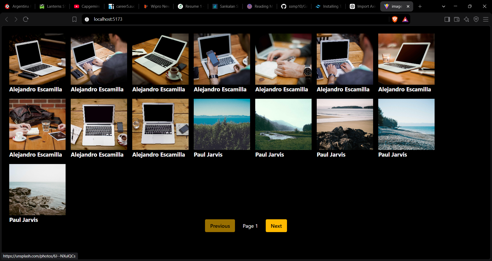
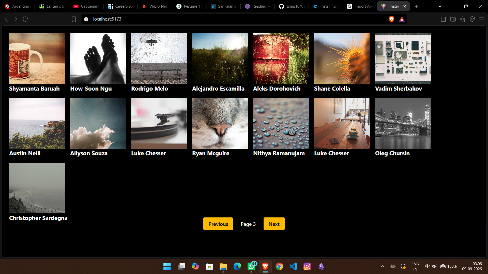

# 📸 Image Gallery

A responsive image gallery built with React and the Unsplash API. 
The application dynamically fetches images from the API and displays them 
in a clean grid layout with pagination.


## 📷 Screenshots

### Gallery



### Pagination




## ✨ Features

- Fetches images dynamically from the Unsplash API
- Displays images in a responsive grid
- Pagination for browsing multiple pages of images
- Displays photographer information
- Dynamic rendering using React
- Loading state while fetching data
- Error handling for failed API requests

## 🛠️ Tech Stack

- React
- JavaScript
- CSS
- Unsplash REST API
- Vite

## 📚 What I Learned

While building this project, I practiced:

- Working with REST APIs in React
- Using `fetch()` to retrieve external data
- Managing component state with `useState`
- Handling side effects with `useEffect`
- Rendering lists using `.map()`
- Passing data through props
- Conditional rendering
- Implementing pagination
- Handling loading and error states
- Building responsive layouts with CSS

## ⚙️ Getting Started

### 1. Clone the repository

```bash
git clone https://github.com/ssmp10/Gallery